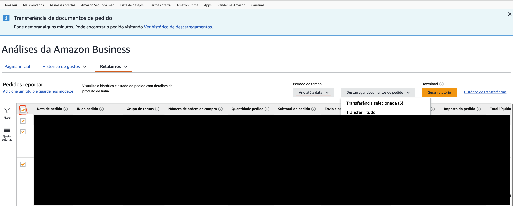

# Amazon Invoices Organizer

> This script is intended for use with Amazon.es Business invoices. It relies on identifying certain keywords in Spanish to properly parse the files.

Amazon sometimes merges multiple invoices into a single file but I need to submit a single Amazon invoice per file to my accounting software. Splitting the downloaded invoices into a single invoice per file is the main goal of this script.

Additionally, it also extracts the date, total amount and invoice number and renames the invoice file with that data, making it a bit easier to keep track of what's in there.

The script will recursively find all invoices into the given directory.

## Usage

```shell
usage: amazon_invoices.py [-h] [--output OUTPUT] directory

Split Amazon Business invoices into separate PDFs.

positional arguments:
  directory        Directory to recursively scan for PDF invoices.

options:
  -h, --help       show this help message and exit
  --output OUTPUT  Directory to save split invoices.
```

## Downloading bulk invoices from Amazon Business

1. Go to https://www.amazon.es/b2b/aba/reports?reportType=items_report_1&dateSpanSelection=MONTH_TO_DATE&ref=hpr_redirect_report
2. Select the desired time period
3. Select all orders
4. Click on Download selected (x)


